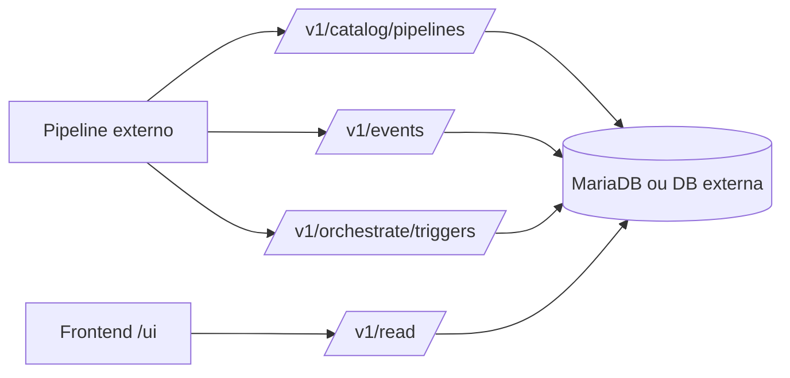

# Overseer


Overseer é um núcleo local para observar pipelines e DAGs por API. Recebe catálogo, runs, módulos, logs e heartbeats, persiste eventos numa base de dados e mostra o estado operacional num frontend estático servido pela própria FastAPI.

## Funcionalidades

- API de catálogo para registar pipelines, nodes e edges de DAG.
- API de eventos para runs, módulos, logs e heartbeats.
- Triggers operacionais sem execução local de código de pipelines.
- Frontend em `/ui/dashboard.html` ligado aos endpoints reais.
- SDK e agente Python para instrumentação em repositórios de pipelines externos.
- Workflow Docker-first com API, UI e MariaDB local.

## Stack Técnica

| Área | Tecnologia |
|---|---|
| API | FastAPI, Uvicorn |
| Frontend | HTML, CSS e JavaScript estático |
| Base de dados | MariaDB local; SQLAlchemy com suporte a outros dialectos |
| SDK / Agent | Python, HTTPX |
| Docker | Dockerfile Python e Docker Compose |
| Testes | pytest |

## Arquitetura



## Estrutura

```text
Overseer/
  docs/
  frontend/
    css/
    js/
    dashboard.html
    deployments.html
    lineage.html
    run-detail.html
  openapi/
  overseer_agent/
  overseer_monitor/
  overseer_sdk/
  scripts/
  src/
    overseer_api/
    overseer_core/
  templates/pipeline-repo/
  tests/
  docker-compose.yml
  Dockerfile
  requirements.txt
```

## Requisitos

- Docker com Docker Compose para execução recomendada.
- Python 3.11+ apenas para desenvolvimento local ou testes fora de Docker.

## Instalação E Execução

```bash
docker compose up --build -d
```

Entradas locais:

```text
UI: http://127.0.0.1:8090/ui/dashboard.html
API docs: http://127.0.0.1:8090/docs
Health: http://127.0.0.1:8090/v1/health
```

Scripts equivalentes:

| Sistema | Comando |
|---|---|
| Windows CMD | `overseer-up.cmd` |
| PowerShell | `.\scripts\overseer-up.ps1` |
| Linux/macOS | `sh scripts/overseer-up.sh` |

## Configuração

Usar `.env.example` como referência e nunca versionar `.env` real.

| Variável | Obrigatória | Descrição |
|---|---:|---|
| `OVERSEER_API_TOKEN` | Não | Token Bearer para endpoints protegidos. |
| `OVERSEER_API_PORT` | Não | Porta HTTP local; padrão `8090`. |
| `OVERSEER_DB_URL` | Não | URL SQLAlchemy para DB externa/oficial. |
| `MYSQL_PASSWORD` | Não | Password local MariaDB do Compose. |
| `MYSQL_ROOT_PASSWORD` | Não | Password root local MariaDB do Compose. |

## Uso Por API

Registar um DAG:

```bash
curl -X POST http://127.0.0.1:8090/v1/catalog/pipelines ^
  -H "Content-Type: application/json" ^
  -d "{\"pipeline_id\":\"demo_dag\",\"nodes\":[{\"module_id\":\"extract\"},{\"module_id\":\"load\"}],\"edges\":[{\"from_module_id\":\"extract\",\"to_module_id\":\"load\"}]}"
```

Emitir uma run de demonstração:

```bash
docker compose exec overseer-api python scripts/overseer_emit_demo.py
```

Integração em pipelines externos:

```bash
python -m pip install -r templates/pipeline-repo/requirements-overseer.txt
```

Ver [docs/pipeline-integration.md](docs/pipeline-integration.md).

## Comandos Principais

```bash
python -m pytest -q
docker compose config
docker compose build
docker compose up -d
docker compose logs -f overseer-api
```

## Testes, Lint E Build

Testes:

```bash
python -m pytest -q
```

Lint: N/A — não há ferramenta de lint configurada no repositório.

Build:

```bash
docker compose build
```

## Docker / Deploy

Docker é o fluxo principal porque o projeto inclui API, base de dados local e frontend servido pela API.

Serviços:

| Serviço | Função |
|---|---|
| `overseer-api` | FastAPI, SDK local e frontend estático. |
| `mysql` | MariaDB local para desenvolvimento. |

Deploy remoto/produção: A confirmar. Não há configuração de produção validada neste repositório.

## Troubleshooting

| Sintoma | Ação |
|---|---|
| API devolve 401 | Guardar na UI o mesmo token definido em `OVERSEER_API_TOKEN`. |
| DB aparece indisponível | Verificar `docker compose ps`, `OVERSEER_DB_URL` e logs do serviço `mysql`. |
| Dashboard vazio | Registar um DAG via `/v1/catalog/pipelines` ou executar `scripts/overseer_emit_demo.py`. |
| `/ui/` não abre | Usar `/ui/dashboard.html` e confirmar que o container foi reconstruído. |

## Segurança

- Não guardar `.env`, tokens, passwords, chaves SSH, cookies ou strings de ligação reais no Git.
- Exemplos usam valores fictícios.
- URLs de DB expostas pela API são mascaradas.
- Outputs de pipelines devem ser tratados como dados não confiáveis.

## MCP Servers E Skills

- MCP servers do projeto: N/A — não foi encontrada configuração `.mcp.json`, `.cursor/mcp.json`, `.vscode/mcp.json` ou `.claude/mcp.json`.
- Skills: inventariadas em [.agents/skills/README.md](.agents/skills/README.md) (compatibilidade Claude em `.claude/skills/`).

## Changelog

Ver [CHANGELOG.md](CHANGELOG.md).

## Licença

A confirmar.
