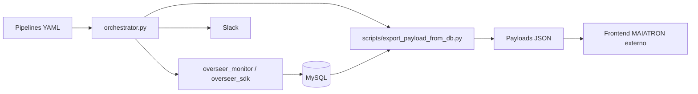

# Overseer


Overseer e um runtime Python para orquestrar pipelines, recolher telemetria operacional e publicar dados JSON consumidos por frontend externo MAIATRON. O repositorio nao detem o HTML/JS/CSS canonico da app MAIATRON; mantem o fluxo de dados, o scheduler, SDKs de monitorizacao e templates de pipelines.

## Funcionalidades Principais

- Execucao de pipelines definidos em `pipelines/<pipeline_id>/pipeline.yaml`.
- Scheduler daemon em `orchestrator.py scheduler`, sem dependencia obrigatoria de cron.
- Emissao de lineage por stdout com marcadores `@@OVERSEER_MODULE@@`.
- Escrita de eventos, runs e permissao por pipeline em MySQL.
- Export de payloads JSON para consumo por frontend externo.
- Notificacoes Slack para erros e resumo diario.
- Templates de pipeline com `src`, `config` e `secrets`.
- Suporte a runners por host via `runner_host`.

## Stack Tecnica

| Area | Tecnologia confirmada |
|---|---|
| Runtime / CLI | Python 3, `orchestrator.py` |
| Scheduler | Loop proprio em Python com `croniter` |
| Base de dados | MySQL via `pymysql` / SQLAlchemy |
| Configuracao | YAML, JSON e variaveis de ambiente |
| Monitorizacao | `overseer_monitor`, `overseer_sdk` |
| Frontend | Externo ao repo; este repo publica dados JSON |
| Notificacoes | Slack webhook configurado por ficheiro/env |
| Testes | `pytest` no manifesto; suite nao validada nesta sessao |

## Arquitetura



## Estrutura Do Projeto

```text
Overseer/
  .claude/skills/              # Skills duplicadas para Claude Code
  config/                      # Exemplos de configuracao local
  docs/                        # PRDs, guias e ADRs
  overseer_monitor/            # Monitorizacao e lineage
  overseer_sdk/                # Utilitarios partilhados de runtime
  pipelines/                   # Templates e pipelines concretas
  runtime/                     # Artefactos runtime e assets sincronizados
  scripts/                     # Export, arquivo e digest Slack
  secrets/                     # Apenas exemplos e README versionados
  skills/                      # Skills canonicas do repo
  src/pm_runtime/              # Servicos auxiliares do runtime
  tasks/                       # Plano e licoes operacionais
  orchestrator.py              # CLI e scheduler principal
  overseer.py                  # Wrapper curto do runtime
  requirements.txt             # Dependencias Python
```

## Requisitos

- Python 3.10+ recomendado.
- MySQL acessivel quando forem executados pipelines, exports ou comandos que persistem telemetria.
- Credenciais locais criadas a partir dos ficheiros `.example`.
- Acesso Slack apenas se as notificacoes estiverem activas.

## Instalacao

```powershell
python -m venv .venv
.\.venv\Scripts\Activate.ps1
pip install -r requirements.txt
```

## Configuracao E Segredos

Criar ficheiros reais apenas localmente, nunca versionar:

- `secrets/database.json` a partir de `secrets/database.json.example.json`;
- `secrets/slack.json` a partir de `secrets/slack.json.example`;
- `pipelines/<pipeline_id>/secrets/*.json` a partir dos exemplos do pipeline.

Variaveis principais em `.env.example`:

- `DB_URL`;
- `RUNS_TABLE`;
- `P_MONITOR_DB_HOST`;
- `P_MONITOR_DB_PORT`;
- `P_MONITOR_DB_USER`;
- `P_MONITOR_DB_PASSWORD`;
- `P_MONITOR_DB_NAME`;
- `P_MONITOR_FRONTEND_URL`;
- `ORCHESTRATOR_ENABLED`.

O README nao deve conter passwords, tokens, chaves SSH, cookies ou strings de ligacao reais. Se uma credencial real tiver sido publicada anteriormente, deve ser rodada no sistema de origem.

## Utilizacao

```powershell
python orchestrator.py list
python orchestrator.py run example_pipeline
python orchestrator.py run microsoft_forms_2_datalake
python orchestrator.py run --file pipelines\_template\pipeline.yaml
python orchestrator.py trigger enqueue example_pipeline --by Emanuel
python orchestrator.py trigger consume --runner host-a
python orchestrator.py export
python orchestrator.py archive --days 30
```

Scheduler daemon:

```powershell
python orchestrator.py scheduler
python orchestrator.py scheduler --once
python orchestrator.py scheduler --tick 30
python orchestrator.py scheduler --workers 4
```

Permissoes por pipeline:

```powershell
python orchestrator.py user list
python orchestrator.py user grant <username> <pipeline_id> --role executor
python orchestrator.py user grant <username> <pipeline_id> --role owner
python orchestrator.py user revoke <username> <pipeline_id>
python orchestrator.py user show <pipeline_id>
```

`python orchestrator.py deploy-frontend` esta bloqueado por politica: o Overseer publica dados JSON, nao assets HTML/JS/CSS do frontend MAIATRON.

## Pipelines Incluidas

- `_template`: baseline para novos pipelines.
- `microsoft_forms_2_datalake`: integracao Windows/Excel-Forms; requer secrets locais.
- `webapp_medidata`: pipeline operacional especial; a configuracao de base de dados deve alinhar com a app MAIATRON publicada.

## Testes, Lint E Build

Dependencias de teste existem em `requirements.txt`, incluindo `pytest`.

```powershell
python -m pytest
python -m compileall orchestrator.py overseer_monitor overseer_sdk scripts src pipelines
```

Validacao nesta sessao: `python orchestrator.py --help` falhou porque o ambiente Python activo nao tinha `PyYAML` instalado. Executar a instalacao antes de validar CLI, testes ou scheduler.

## API HTTP (canonica)

```powershell
uvicorn src.overseer_api.main:app --host 0.0.0.0 --port 8090
```

Endpoints principais: `GET /v1/monitoring/full`, `GET /v1/health`, `POST /v1/triggers`, UI em `/ui/`.

MAIATRON-HUB consome via BFF (`OVERSEER_API_URL` + `OVERSEER_API_TOKEN`).

## Docker / Deploy

```powershell
docker compose --profile local up -d
```

Servicos: `overseer-api`, `overseer-scheduler`, `mysql` (profile `local`).

Deploy operacional:

- telemetria via API HTTP (sem export JSON obrigatorio);
- frontend MAIATRON externo via BFF `api.php`;
- `deploy-frontend` esta bloqueado por politica.

## Troubleshooting

| Sintoma | Verificacao |
|---|---|
| `ModuleNotFoundError: No module named 'yaml'` | Activar `.venv` e executar `pip install -r requirements.txt`. |
| Export nao gera payload | Confirmar `DB_URL` ou `secrets/database.json` e tabelas MySQL. |
| Slack nao envia notificacoes | Confirmar `secrets/slack.json` local e overrides por pipeline. |
| Frontend nao actualiza | Confirmar que os JSON exportados estao no caminho servido pelo frontend externo. |
| Runner nao consome trigger | Verificar `runner_host` no YAML e o valor passado em `--runner`. |

## MCP Servers E Skills

- MCP servers do projeto: nao foram encontrados ficheiros `.mcp.json`, `.cursor/mcp.json`, `.vscode/mcp.json` ou `.claude/mcp.json`.
- Skills locais: inventariadas em `SKILLS.md`, com copias em `skills/*/SKILL.md` e `.claude/skills/*/SKILL.md`.

## Documentacao

- `PROJECT_CONTEXT.md`: contexto especifico do projeto.
- `AGENTS.md`: regras obrigatorias para agentes.
- `HANDOFF.md`: estado operacional entre sessoes.
- `CHANGELOG.md`: historico versionado.
- `CHANGELOG_POLICY.md`: formato obrigatorio do changelog.
- `docs/PRD_PM_Universal_DropIn_AI_Ready.md`: PRD mestre.
- `docs/AI_HANDOFF_CHECKLIST.md`: checklist para IA.
- `docs/PRD_PM_Pipeline_Project_Standard.md`: standard de estrutura de pipeline.

## Licenca

A confirmar.
