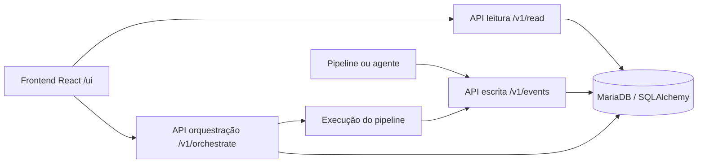

# Overseer


Overseer é um núcleo local para orquestrar pipelines, receber telemetria por API, persistir eventos numa base de dados e mostrar o estado operacional num frontend React servido pela própria API.

## Funcionalidades Principais

- API de leitura em `/v1/read/*`.
- API de escrita em `/v1/events/*` para runs, módulos, logs e heartbeats.
- API de orquestração em `/v1/orchestrate/*` para triggers e execução de pipelines.
- Frontend React/Vite em `/ui/`.
- Schema novo simples em tabelas `overseer_*`.
- SDK Python e CLI `overseer-agent` para instrumentar pipelines.
- Template padrão para integrar Overseer em repos de pipelines.
- Workflow oficial por Docker Compose, sem instalar Python ou Node no host.
- Exemplo real mantido: `microsoft_forms_2_datalake`.

## Stack Técnica

| Área | Tecnologia |
|---|---|
| API | FastAPI, Uvicorn |
| Frontend | React, Vite, lucide-react |
| Base de dados | MariaDB local por Docker; SQLAlchemy prepara outros dialectos como PostgreSQL |
| SDK / Agent | Python, HTTPX |
| Configuração | Variáveis de ambiente, `.env.example`, YAML de pipelines |
| Testes | `pytest` |
| Deploy local | Docker Compose |

## Arquitetura



## Estrutura Do Projeto

```text
Overseer/
  docs/adr/                       # Decisões técnicas
  docs/pipeline-integration.md     # Contrato padrão para repos de pipelines
  overseer_agent/                 # CLI para heartbeat, trigger, run e exec
  overseer_monitor/               # Adaptador compatível para pipelines antigos
  overseer_sdk/                   # SDK Python, cliente HTTP e utilitários
  openapi/                        # Contrato API versionado
  pyproject.toml                   # Pacote instalável overseer-core
  pipelines/
    microsoft_forms_2_datalake/   # Exemplo real mantido
  scripts/
    overseer-up.ps1               # Arranque Docker para Windows PowerShell
    overseer-up.sh                # Arranque Docker para Linux/macOS
    overseer_emit_demo.py          # Emite uma run de demonstração por API
  src/
    overseer_api/                 # FastAPI e routers
    overseer_core/                # Store SQLAlchemy e execução de pipelines
  tasks/                          # Plano operacional
  templates/pipeline-repo/         # Kit copiável para repos de pipelines
  webapp/                         # React/Vite; build feito dentro do Docker
  docker-compose.yml
  Dockerfile
  overseer-up.cmd                 # Atalho Windows
  requirements.txt
```

## Requisitos

- Docker Desktop, Docker Engine ou ambiente equivalente com `docker compose`.
- Porta `8090` disponível, ou definir `OVERSEER_API_PORT`.
- Python e Node locais não são necessários para arrancar o Overseer.

## Instalação E Arranque

Windows:

```powershell
.\overseer-up.cmd
```

PowerShell:

```powershell
.\scripts\overseer-up.ps1
```

Linux/macOS:

```bash
sh scripts/overseer-up.sh
```

Manual:

```bash
docker compose up --build -d
```

URLs locais:

- UI: `http://127.0.0.1:8090/ui/`
- API docs: `http://127.0.0.1:8090/docs`
- Health: `http://127.0.0.1:8090/v1/health`

## Configuração E Segredos

Copiar `.env.example` para `.env` quando for preciso alterar portas, token ou credenciais locais. Não versionar `.env`.

Variáveis principais:

- `OVERSEER_API_TOKEN`: token Bearer para APIs protegidas.
- `OVERSEER_API_PORT`: porta HTTP local.
- `OVERSEER_DB_URL`: URL SQLAlchemy canónico. Se estiver vazio no Compose, é usado o MariaDB local; se estiver preenchido, a API usa essa DB, incluindo o schema oficial `Overseer`.
- `MYSQL_PASSWORD` e `MYSQL_ROOT_PASSWORD`: credenciais MariaDB local.

O frontend guarda o token apenas em `sessionStorage`.

Para ligar ao schema oficial, copiar `.env.official.example` para `.env`, preencher `OVERSEER_DB_URL` com a ligação real e reiniciar:

```bash
docker compose up -d
```

O frontend mostra o modo da base de dados no bloco `DB`; `external` indica uma ligação fora do serviço MariaDB local do Compose.

## APIs Principais

Leitura:

```http
GET /v1/read/overview
GET /v1/read/database
GET /v1/read/pipelines
GET /v1/read/runs
GET /v1/read/runs/{run_id}
```

Escrita:

```http
POST /v1/events/runs/start
POST /v1/events/runs/{run_id}/finish
POST /v1/events/modules
POST /v1/events/logs
POST /v1/events/heartbeat
```

Orquestração:

```http
POST /v1/orchestrate/triggers
POST /v1/orchestrate/pipelines/{pipeline_id}/run
```

## SDK E Agent

Instrumentação Python:

```python
from overseer_sdk import OverseerClient

client = OverseerClient()
with client.run("microsoft_forms_2_datalake") as run_id:
    with client.step(run_id=run_id, pipeline_id="microsoft_forms_2_datalake", module_id="processamento"):
        ...
```

Executar qualquer comando com registo via API:

```bash
python -m overseer_agent exec --pipeline microsoft_forms_2_datalake -- python src/main.py
```

No workflow oficial, a execução operacional é feita por Docker/API; comandos Python locais são apoio de desenvolvimento.

## Integração Em Repos De Pipelines

O contrato padrão está em `docs/pipeline-integration.md`.

Copiar `templates/pipeline-repo/` para a raiz de cada repo de pipeline. O formato esperado é sempre:

```text
pipeline-repo/
  .env.overseer.example
  pipeline.yaml
  requirements-overseer.txt
  overseer_bootstrap.py
  src/main.py
```

Cada pipeline deve escrever telemetria pela API do Overseer, nunca diretamente na DB.

Para gerar dados de demonstração no schema atualmente ligado:

```bash
docker compose exec overseer-api python scripts/overseer_emit_demo.py
```

## Testes E Validação

Testes Python:

```bash
python -m pytest -q
```

Build completo via Docker:

```bash
docker compose build
```

O build do frontend é executado dentro da imagem Node do Dockerfile. Isto evita dependências Node no host e reduz diferenças entre Windows, Linux e macOS.

## Docker / Deploy

Serviços:

- `overseer-api`: API FastAPI e frontend compilado.
- `mysql`: MariaDB local.

Volumes:

- `overseer_mysql_data`: dados MariaDB.
- `/app/pipelines`: exemplo versionado dentro da imagem.
- `./pipelines:/app/host_pipelines:ro`: pipelines externos do host, sem tapar o exemplo interno.
- `./runtime:/app/runtime`: artefactos locais.

## Troubleshooting

| Sintoma | Verificação |
|---|---|
| `docker` não é reconhecido | Instalar Docker Desktop ou Docker Engine e confirmar `docker compose version`. |
| UI não abre | Verificar `docker compose ps` e `docker compose logs overseer-api`. |
| Health falha | Verificar se o serviço `mysql` está saudável. |
| API devolve 401 | Preencher o token no frontend com o valor de `OVERSEER_API_TOKEN`. |
| Build Node falha no host | Usar Docker; `node_modules` local não é necessário. |

## MCP Servers E Skills

- MCP servers do projeto: não foram encontrados ficheiros `.mcp.json`, `.cursor/mcp.json`, `.vscode/mcp.json` ou `.claude/mcp.json`.
- Skills locais: inventariadas em `SKILLS.md`.

## Documentação

- `PROJECT_CONTEXT.md`: contexto específico do projeto.
- `AGENTS.md`: regras obrigatórias para agentes.
- `HANDOFF.md`: continuidade operacional.
- `CHANGELOG.md`: histórico versionado.
- `docs/adr/0001-overseer-core-api-refactor.md`: decisão do refactor Core API.

## Licença

A confirmar.
