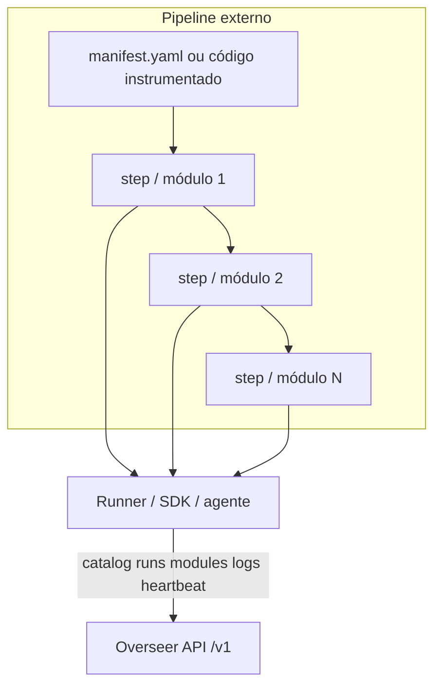
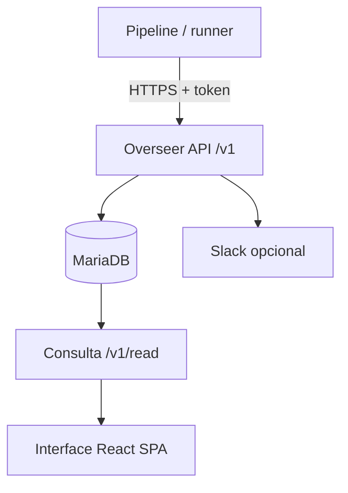

# Overseer


O Overseer é um serviço Docker-first de observabilidade para pipelines e DAGs externos. Centraliza catálogos, execuções, módulos, logs e sinais operacionais numa API, persiste o estado e apresenta-o numa interface web de consulta.

O serviço observa pipelines; não incorpora o respetivo código nem substitui o orquestrador que os executa. Esta separação permite integrar processos Python, tarefas agendadas, jobs de CI ou outros runners sem acoplar o seu ciclo de vida ao Overseer.

O repositório é também a fonte de verdade do proxy público
`api/overseer.php`, publicado isoladamente em `/usr/share/nginx/html/api`.
O WELLS_API conserva apenas uma cópia auditada e o Swagger agregado.

## Documentação normativa

| Documento                                   | Finalidade                                         |
| ------------------------------------------- | -------------------------------------------------- |
| [`PROJECT_CONTEXT.md`](PROJECT_CONTEXT.md) | Contexto técnico vivo do produto                  |
| [`COMMANDS.md`](COMMANDS.md)               | Comandos reais de desenvolvimento, testes e deploy |
| [`CONTRIBUTING.md`](CONTRIBUTING.md)       | Fluxo de contribuição e commits                   |
| [`SECURITY.md`](SECURITY.md)               | Regras de segurança e reporte                     |
| [`docs/architecture/`](docs/architecture/) | Arquitetura por camada                             |

## O que resolve

- oferece uma visão comum de pipelines distribuídos por vários hosts;
- regista o início, progresso e resultado de cada execução;
- representa módulos e dependências de um DAG;
- identifica falhas abertas e pipelines fora da cadência esperada;
- mantém uma interface web read-only para consulta operacional;
- disponibiliza SDK, agente e exemplos para integração externa;
- suporta triggers opcionais, consumidos pelos runners autorizados;
- envia alertas de falha e um digest diário para Slack.

Não é um motor de workflows, um gestor de segredos ou um substituto de uma plataforma de logs. O pipeline continua responsável pela execução, pelos retries de negócio e pelo tratamento dos seus dados.

## Tecnologias

- **Frontend:** React 19, TypeScript, Vite, React Router, TanStack Query, Tailwind CSS
- **Backend:** FastAPI, Uvicorn, Python 3.11+
- **Base de dados:** MariaDB 10.11, SQLAlchemy
- **Infraestrutura:** Docker Compose; nginx opcional para `/Overseer/`
- **Testes:** pytest; build frontend com `npm run build`

## Arquitetura técnica do pipeline

O Overseer **observa** pipelines externos; não executa o seu código. O pipeline vive fora deste repositório; cada passo emite telemetria para a API `/v1`:



Consulte [Integração de pipelines](docs/pipeline-integration.md) e o contrato em `src/overseer_sdk/manifest_runner.py`.

O pipeline regista catálogo, runs, módulos e logs por API; o Overseer persiste o estado e expõe a interface em **`/Overseer/`** (nginx em produção) ou **`/ui/`** (Docker local).

## Observabilidade Overseer



A API FastAPI é o ponto de entrada canónico. Domínio e persistência em **src/overseer_core/**; SDK e agente partilham o mesmo contrato HTTP. Produção: `http://<host>/Overseer/` via `scripts/deploy-nginx-frontend.sh`. Consulte [Arquitetura](docs/architecture/overview.md).

## Arranque local

### Pré-requisitos

- Docker Engine ou Docker Desktop com Compose;
- Git;
- Python 3.11 ou superior para desenvolvimento e testes;
- Node.js 20+ apenas para desenvolvimento frontend (`npm run dev`).

Em Linux ou macOS:

    cp docs/resources/templates/.env.example secrets/.env
    ./scripts/overseer-up.sh

No PowerShell:

    Copy-Item docs/resources/templates/.env.example secrets/.env
    .\scripts\dev-ui.ps1

Confirme o arranque:

    curl http://127.0.0.1:8090/v1/health

Serviços disponíveis por defeito:

- API e health: **http://127.0.0.1:8090/v1/health**;
- interface local: **http://127.0.0.1:8090/ui/**;
- interface produção (nginx): **`/Overseer/`** no host público;
- contrato OpenAPI: **openapi/overseer-api.yaml**;
- MariaDB local: porta **3307** do host.

Os valores do exemplo destinam-se exclusivamente a desenvolvimento. Antes de usar outro ambiente, substitua tokens e passwords e restrinja as origens CORS.

### Desenvolvimento frontend

Com a API a correr localmente:

```bash
cd frontend
npm ci
npm run dev
```

O servidor Vite faz proxy de `/v1` para a API. Para produção ou Docker, `npm run build` gera `frontend/dist/`, copiado pela imagem.

## Configuração

| Variável                     | Finalidade                                   | Desenvolvimento              |
| ----------------------------- | -------------------------------------------- | ---------------------------- |
| OVERSEER_API_PORT             | Porta HTTP publicada pelo Compose            | 8090                         |
| OVERSEER_API_TOKEN            | Token exigido nos endpoints protegidos       | valor local do exemplo       |
| OVERSEER_CORS_ORIGINS         | Origens autorizadas, separadas por vírgulas | *                            |
| OVERSEER_DB_URL               | Ligação SQLAlchemy à base de dados        | MariaDB do Compose           |
| OVERSEER_RUNNERS_DIR          | Diretório privado com hosts e catálogos    | ./deploy/runners             |
| OVERSEER_RUNTIME_DIR          | Estado persistente fora da imagem            | ./runtime                    |
| OVERSEER_SSH_SYNC_ENABLED     | Ativa sincronização remota por SSH         | 1                            |
| OVERSEER_SLACK_WEBHOOK_URL    | Webhook de Slack, opcional                   | não definido                |
| OVERSEER_SLACK_DIGEST_ENABLED | Ativa o resumo diário                       | herda a presença do webhook |
| OVERSEER_SLACK_DIGEST_HOUR    | Hora do digest em Europe/Lisbon              | 8                            |
| OVERSEER_SLACK_DIGEST_MINUTE  | Minuto do digest                             | 30                           |
| OVERSEER_NAME_PREFIX_STRIP    | Prefixos removidos em nomes (API, UI, Slack) | `Yunex `                     |
| OVERSEER_RETENTION_DAYS       | Janela de retenção de telemetria             | 30                           |
| OVERSEER_RETENTION_AUTO       | Ativa a retenção automática                   | true                         |
| OVERSEER_RETENTION_POLL_SECONDS | Intervalo de verificação (throttle diário)  | 3600                         |

O digest inclui resultados, falhas abertas e pipelines fora de cadência. Heartbeats e triggers em fila permanecem consultáveis pela API e pela interface, mas não são enviados no resumo. Por cada episódio de falha e deployment (`pipeline_id` + `host_id`), o Overseer envia no máximo três avisos imediatos; o terceiro informa que os avisos seguintes passam para o digest até resolução. Uma execução não falhada reinicia este limite. O digest diário (08:30) e os alertas imediatos de falha/resolução mencionam `@channel` quando `OVERSEER_SLACK_MENTION_CHANNEL=true` (defeito).

### Configuração privada

**OVERSEER_RUNNERS_DIR** deve apontar para um diretório fora do checkout em produção. Esse diretório contém **hosts.yaml** e um catálogo **host-id.yaml** por host e é montado no contentor em **/app/deploy/runners**. O repositório inclui apenas exemplos genéricos.

**OVERSEER_RUNTIME_DIR** também deve apontar para armazenamento persistente fora do checkout. Assim, uma atualização ou reversão de código não move nem elimina estado operacional.

Nunca versione `secrets/.env`, tokens, webhooks, chaves SSH, catálogos reais ou cópias da base de dados.

## Integrar um pipeline

Uma integração típica:

1. regista o catálogo e a topologia do pipeline;
2. abre uma run antes da execução;
3. comunica módulos e logs relevantes;
4. fecha a run com ok, warning ou failed;
5. opcionalmente envia heartbeats e consome triggers.

O SDK Python reduz o código necessário, mas qualquer cliente HTTP pode usar a API `/v1`. Consulte [Integração de pipelines](docs/pipeline-integration.md), os [exemplos](docs/resources/examples/overseer/) e o contrato [OpenAPI](openapi/overseer-api.yaml).

## Desenvolvimento e qualidade

```bash
python -m pip install -r src/requirements.txt
python -m pip install -e ./src
python -m pytest -q
cd frontend && npm ci && npm run build
docker compose --project-directory . -f docker/docker-compose.yml config
docker compose --project-directory . -f docker/docker-compose.yml build
```

O backend usa FastAPI e SQLAlchemy. O frontend usa React, TypeScript, Vite, React Router e TanStack Query. Os restantes comandos suportados estão em [COMMANDS.md](COMMANDS.md).

## Estrutura do repositório

| Diretório | Conteúdo                                                   |
| ---------- | ----------------------------------------------------------- |
| src/       | API, domínio, persistência, SDK, agente e monitorização |
| frontend/  | SPA React (código-fonte e`dist/` após build)            |
| openapi/   | contrato público da API                                    |
| docker/    | imagem e ficheiros Compose                                  |
| deploy/    | exemplos públicos de configuração operacional            |
| runtime/   | estado local ignorado pelo Git                              |
| scripts/   | arranque, deploy, manutenção e integração ([índice](scripts/README.md)) |
| tests/     | testes automatizados                                        |
| docs/      | arquitetura, operação, governação e exemplos            |

## Operação e produção

Uma atualização de produção deve preservar `secrets/.env`, catálogos privados, runtime, volumes e referência da imagem ativa. Valide primeiro a configuração Compose e o build num checkout paralelo. Depois da troca, confirme health, base de dados, interface, catálogos e estabilidade dos contentores.

O rollback restaura o checkout e a imagem anteriores, mantendo configuração e volumes. Não use `docker compose down -v` num procedimento normal de atualização. Consulte [docs/architecture/deployment.md](docs/architecture/deployment.md).

## Troubleshooting

| Problema | Causa provável | Solução |
| --- | --- | --- |
| `/v1/health` falha | Compose parado, DB inacessível ou `secrets/.env` incompleto | Confirmar contentores, `OVERSEER_DB_URL` e logs da API |
| UI local sem dados | API em falta ou token incorrecto em `overseer-config.js` | Arrancar com `scripts/dev-ui.ps1` / `overseer-up.sh` e rever `OVERSEER_API_TOKEN` |
| `npm ci` / `npm install` falha no Drive | Sync Google Drive (EPERM/EBADF em `node_modules`) | Instalar/build num disco local ou validar no stage Docker |
| Digest Slack não chega | Webhook ausente ou digest desactivado | Confirmar `secrets/slack.json` ou `OVERSEER_SLACK_WEBHOOK_URL` e `OVERSEER_SLACK_DIGEST_ENABLED` |

## Segurança

Consulte [SECURITY.md](SECURITY.md) (e [.github/SECURITY.md](.github/SECURITY.md)) para comunicar vulnerabilidades sem expor detalhes publicamente.

## Contribuição

As regras de contribuição estão em [CONTRIBUTING.md](CONTRIBUTING.md).

## Licença

O repositório é público para consulta e avaliação. O código permanece sob [licença proprietária](LICENSE); a visibilidade pública não concede direitos de utilização, modificação ou redistribuição sem autorização escrita do titular.

## Changelog

Histórico versionado em [CHANGELOG.md](CHANGELOG.md). A versão actual está em [VERSION](VERSION).
