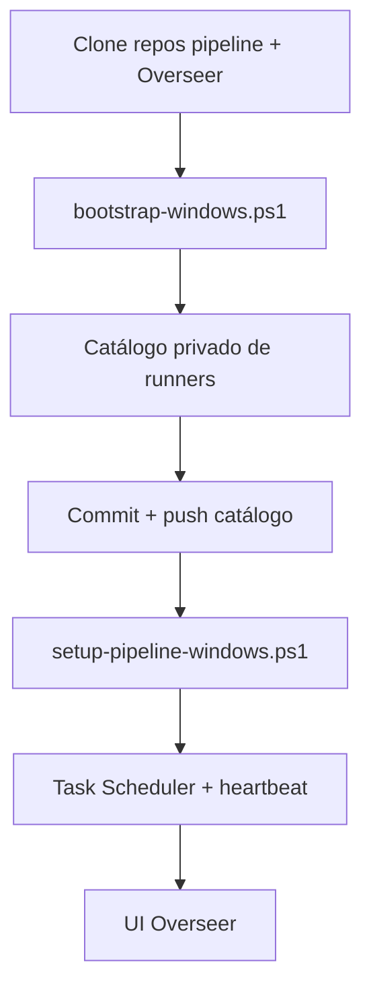

# Onboarding de pipeline Windows (Task Scheduler)

Guia para ligar um repositório de pipeline a uma **máquina Windows nova** (conta
**sem privilégios de administrador**), com observabilidade Overseer.

## Visão geral



| Componente | Onde |
|---|---|
| Repo do pipeline | Ex.: `C:\Pipelines\example_pipeline` |
| Repo Overseer | Ex.: `C:\Tools\Overseer` |
| Runner gerado | `%USERPROFILE%\overseer-runners\<pipeline_id>\run.ps1` |
| Config Overseer | `%USERPROFILE%\overseer-runners\.env.overseer` |
| API (via túnel) | `http://127.0.0.1:18090` |

## Pré-requisitos

1. Python 3.8–3.12 instalado para o pipeline e para o Overseer (venv separado).
2. SSH por chave (ou agent) para o servidor prod (`operator@server.example.com`).
3. Pasta OneDrive/SharePoint sincronizada (se o pipeline ler Excel localmente).
4. `secrets/` do pipeline preenchidos (`database.json`, `paths.json`, etc.).

## Passo 1 — Infra Overseer (uma vez por máquina)

Na máquina Windows, PowerShell **sem admin**:

```powershell
cd C:\Tools\Overseer
git pull origin main

powershell -ExecutionPolicy Bypass -File .\scripts\windows\bootstrap-windows.ps1 `
  -RepoPath C:\Tools\Overseer `
  -SshTarget operator@server.example.com
```

Isto instala o agente, cria `.env.overseer`, regista **Overseer SSH Tunnel** e
**Overseer Heartbeat** no Task Scheduler (`-RunLevel Limited`).

## Passo 2 — Catálogo no repo Overseer

```powershell
.\scripts\windows\show-host-catalog.ps1
```

Se o ficheiro `$OVERSEER_RUNNERS_DIR/<HOST>.yaml` ainda não existir no diretório privado:

```powershell
# Forms
.\scripts\windows\new-host-catalog.ps1 -Template _example.yaml

# Example (quando aplicável)
.\scripts\windows\new-host-catalog.ps1 -Template _example.yaml
```

Editar o YAML gerado:

- `command` → caminho real do `python.exe`
- `cwd` → pasta de trabalho do pipeline no host
- `log` → ficheiro de log do runner Overseer
- `schedule` → cron de 5 campos (ex.: `"45 7 * * *"` = diário 07:45)
- `task_scheduler_name` → nome visível no Task Scheduler (opcional; senão `Overseer - <id>`)

**Commit + push** do ficheiro no repo Overseer e `git pull` na máquina.

## Passo 3 — Setup do pipeline (um comando)

```powershell
cd C:\Tools\Overseer

powershell -ExecutionPolicy Bypass -File .\scripts\windows\setup-pipeline-windows.ps1 `
  -PipelineId windows_pipeline `
  -SshTarget operator@server.example.com `
  -RemoveLegacyTaskNames @("Forms2Datalake_Sync", "Overseer - windows_pipeline") `
  -TestRun
```

O script:

1. Confirma o túnel SSH em `127.0.0.1:18090`
2. Corre `provision-runners.ps1 -Register`
3. Cria/atualiza a tarefa via `register-pipeline-task.ps1` (sem BOM, sem admin)
4. (Opcional) executa `run.ps1` uma vez
5. Envia inventário Task Scheduler + heartbeat

### Só Task Scheduler (já provisionado)

```powershell
.\scripts\windows\register-pipeline-task.ps1 -PipelineId windows_pipeline
```

### Dry-run

```powershell
.\scripts\windows\register-pipeline-task.ps1 -PipelineId windows_pipeline -WhatIfOnly
```

## Passo 4 — Validar

```powershell
Start-ScheduledTask -TaskName "Windows Example Pipeline"
Get-ScheduledTask -TaskName "Windows Example Pipeline" | Get-ScheduledTaskInfo

.\scripts\windows\heartbeat.ps1
```

Na API / UI Overseer:

- Deployment `windows_pipeline@<HOST_ID>`
- Última run em `/v1/read/runs?pipeline_id=windows_pipeline`
- Inventário em Ambiente → Task Scheduler

## Conta não admin — notas

| Tópico | Recomendação |
|---|---|
| Privilégios | Usar `-RunLevel Limited`; não marcar «Run with highest privileges» |
| Sessão | «Run only when user is logged on» (típico sem admin) |
| `Register-ScheduledTask` bloqueado por GPO | Criar tarefa manualmente na GUI com os mesmos campos que o script imprime em `-WhatIfOnly` |
| SSH para MariaDB | OpenSSH Authentication Agent + `use_agent: true` em `secrets/database.json` |
| Não agendar | `run_pipeline.bat` ou `python run_pipeline.py` directamente — usar sempre `run.ps1` |

## Reprovisionar após `git pull`

```powershell
.\scripts\windows\provision-runners.ps1 -Register
.\scripts\windows\register-pipeline-task.ps1 -PipelineId <pipeline_id>
.\scripts\windows\heartbeat.ps1
```

Alterar só código do pipeline **não** exige mexer no Task Scheduler.

## Referências

- [`docs/pipeline-integration.md`](pipeline-integration.md) — contrato API
- [`deploy/runners/README.md`](../deploy/runners/README.md) — catálogos por host
- [`COMMANDS.md`](../COMMANDS.md) — comandos rápidos
